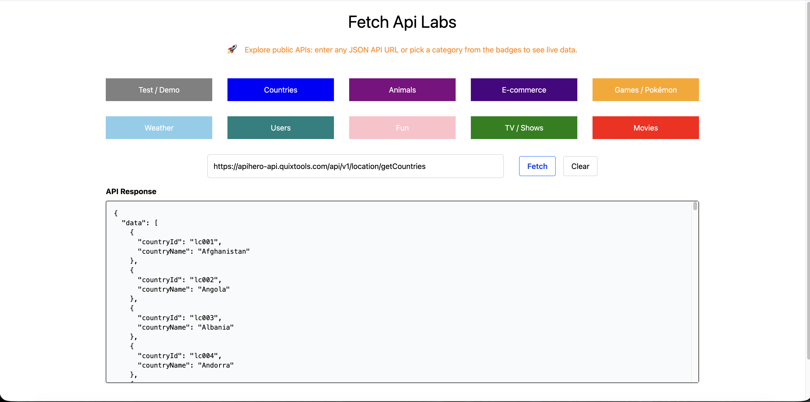

# FetchApiLab 🚀

A React + TypeScript + Tailwind project to explore public APIs dynamically.  

### Features ✨
- 🏷 Select public APIs by category with colored badges.  
- ✏️ Enter any public API URL manually.  
- 📄 View formatted JSON responses.  
- 📱 Responsive design for mobile, tablet, and desktop.  

### Screenshots

### Tech Stack 🛠
- React, TypeScript, TailwindCSS  
- React Context for global state  
- Custom hook `useFetchApi` for fetch management  

### Usage ▶️
1. Click a category badge or enter an API URL.  
2. Click **Fetch** to load data.  
3. View the results in the JSON viewer.  

### Contributing 🤝
Contributions are welcome!

🌐 Live demo: [https://fetchlabapi.netlify.app/](https://fetchlabapi.netlify.app/)

## License

MIT — [Davide Cannerozzi](https://www.linkedin.com/in/davide-cannerozzi-developer/)
